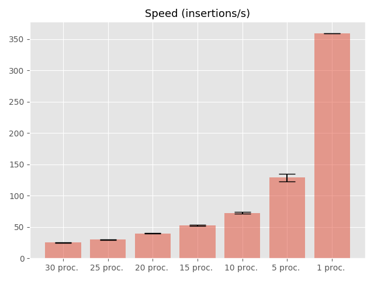

# Design report

## Part 1 - Design
### 1. Design and explain interactions between main components in your architecture of mysimbdp.
The **mysimbdp** big data platform to be designed have the following key components:
* **mysimbdp-coredms**: component that stores and manages data;
* **mysimbdp-dataingest**: read data from external data sources and then store it in mysimbdp-coredms.
* **mysimbdp-daas**: component of which APIs can be called by external data producers/consumers to store/read data into/from mysimbdp-coredms.

At this stage, the **mysimbdp-daas** has not been implemented yet. Then, the interactions in the current architecture only concerns data transfer between between **mysimbdp-coredms** and **mysimbdp-dataingest**.

The mysimbdp-coredms component has been designed as a Cassandra database. Apache Cassandra is a free and open-source, distributed, wide column store, NoSQL database management system designed to handle large amounts of data across many commodity servers, providing high availability and scalability with no single point of failure. This database is used through a Docker container. After having downloading [the official Cassandra image](https://hub.docker.com/_/cassandra), the database running in the container is ready for use.

The mysimbdp-dataingest component is simply a Python script where only a few extra external libraries are required on the machine of the user to make it run. By running this script, a process will:
1. connect to mysimbdp-coredms;
2. read the external data source (googleplaystore_clean.csv);
3. ingest all data from this csv into the database.

### 2. Explain how many nodes are needed in the deployment of mysimbdp-coredms so that this component can work property.
In this simple implementation, only one node is required for the ingestion to work properly. Further performances tests showed that Cassandra could easily handle a lot of processes ingesting data at the same time (even though insertion speed then decreases). 

However, there are two advantages of replicating tthe database through multiple nodes. The first one is stability. Having multiple nodes communicating and sharing the same data can prevent from a failure of the main node. Moreover, security could be improved with multiple nodes. Indeed, if some user tries to corrupt the database by pushing wrong data or deleting some, having replicates could ensure that these bad operations are detected through a consensus for example.

### 3. Will you use VMs or containers for mysimbdp and explain the reasons for each component?
In a Virtual Machine, the operating systems and their applications share hardware resources from a single host server, or from a pool of host servers. Each VM requires its own underlying OS, and the hardware is virtualized. A hypervisor has then the task to create and run the various VMs. It sits between the hardware and the virtual machine and is necessary to virtualize the server. On the other hand, containers sit on top of a physical server and its host OS. Instead of virtualizing the underlying computer like a virtual machine (VM), only the OS is virtualized [[1]](https://www.backblaze.com/blog/vm-vs-containers/).

The following table illustrates the pros and cons of both methods:
| VM           | Container     |
|--------------|---------------|
| Heavyweight | Lightweight |
| Limited performance | Native performance|
| Each VM runs in its own OS | All containers share the host OS|
| Hardware-level virtualization | OS virtualization |
| Startup time in minutes | Startup time in milliseconds|
| Allocates required memory | Requires less memory space|
| Fully isolated and hence more secure | Process-level isolation, possibly less secure |

Hence, Virtual Machines are commonly used for demanding applications, network infrastructure, and apps that will consume most of the resources of the VM. On the other hand, containers are commonly used for web, applications and caching services, network daemons, and small databases. As mysimbdp-coredms isn't a large database and should normally only handle quite simple operations,  I decided to choose a container for the database. I could also have used one for mysimbdp-dataingest, however one simple Python script with very few external libraries could do the job. 

### 4. Explain how would you scale mysimbdp to allow a lot of users using mysimbdp-dataingest to push data into mysimbdp.
One of the biggest advantages of using Cassandra is its elastic scalability. Cassandra cluster can be easily scaled-up or scaled-down, without much disturbance. As scaling happens, read and write throughput both increase simultaneously with zero downtime or any pause to the applications [[2]](https://www.edureka.co/blog/apache-cassandra-advantages/). Hence, in order to scale mysimbdp, one solution would be to automatically scale up or down the number of nodes in the cluster depending on  the number of users ingesting data at the same time. 

### 5. Explain your choice of industrial cloud infrastructure and/or mysimbdp-coredms provider, when you do not have enough infrastructural resources for provisioning mysimbdp.
If infrastructural resources run out, multiple choices for an industrial cloud infrastructure are possible. Among the most famous one, we can mention Amazon Web Service (AWS), Google Cloud Platform and Microsoft Azure. These platforms propose very similar services and should then all fit to our purpose.

As proposed services are relatively the same, choice must be done by considering how these providers handle data privacy, reliabilty, price and performances. As all these platforms are highly used in the industrial world, reliability should be satisfied for each of them. Performances should also be very similar. Then, you should choose wisely by considering how each of of these providers handle data privacy, as well as how much they bill for their services.

I would personally go for Google Cloud Platform as their services are the cheapest of the three and their interface is very intuitive and easy to use.

## Part 2 - Development and deployment

### 1. Design and explain the data schema/structure for mysimbdp-coredms.
For this first assignment, I made the things simple and only create one table called 'apps' in the keyspace 'mysimdbp-coredms'. This table has the following structure:
| Column           | Type          | Description         | Example         |
|------------------|---------------|---------------------|-----------------|
| id (PRIMARY KEY) | uuid          | Unique id for the app | 31818aca-ea8b-11e9-8aeb-acde48001122 |
| name             | text          | Name of the app | Subway Surfers |
| category         | text          | Category of the app | GAME |
| rating           | float         | Rating of the app (out of 5) | 4.1 |
| reviews          | int           | Total number of reviews | 27723193 |
| size             | text          | Size of the app (in bytes) | 11M |
| installs         | text          | Total number of downloads | 1,000,000+ |
| free             | Boolean       | Is the app free ? | False |
| price_dollar     | float         | Price of the app in dollars | 4.99 |
| content_rating   | text          | Age rating of the app | Mature 17+ |
| genres           | text          | Genres of the app | News & Magazines |
| last_updated     | date          | Date of the last update of the app | 2018-07-30 |
| current_version  | text          | Current version of the app | 2.1.1 |
| android_version  | text          | Android version | 4.4 and up |

The primary key is a unique uuid that was not the initial dataset and is generated at each insertion into the Cassandra database.

### 2. Explain how would you partition the data in mysimbdp-coredms into different shards/partitions.
Partitioning the database into multiple smaller tables would speed up the queries that would then access only a fraction of the data. We could parition the database in two ways: vertically and horizontally. 

Vertical partitioning could be done by creating new tables for representing some columns in our ariginal table. For example, the column 'Category' contains a limited number of uniques values. One could then create a table 'category' that would index each one of the values, and then replace the text values in the 'apps' table by their corresponding indexes. This has two advantages. First, the search is faster when looking for an index than a specific text. Moreover, indexing the categories would allow us to easily handle a later change for the name of a category. Indeed, imagine that the category "Vehicles" is later renamed "Cars and trucks", if the table 'category' didn't exist, we would have to change the name of that category for all apps from that genre in the database, while one only needs to change the name of the corresponding index in the 'category' table if we partitioned the database.

Horizontal partitionning is that necessary in our case where only one node handle the storage of the data. Indeed, Cassandra can manage easily a lot of ingestions at the same time with one unique table. However, if we worked with multiple nodes, it could be interesting to partition the table horizontally and distribute the parts to the different nodes in the cluster, each one with an index identifying which node collects which par of the table. That way, when a user would request some data from the database, the cluster will connect him to the corresponding node, leading to a better scalability. Indeed, if all data is stored in the same table and a lot of users are making queries at the same time, an overload could happen (or at least a very low throughput).

### 3. Write a mysimbdp-dataingest that takes data from your selected sources and stores the data into mysimbdp-coredms.
See the 'data_ingest.py' Python script and guidelines in Assignment-1-Deployment to run it.

### 4. Given your deployment environment, show the uploading performance (response time and failure) of the tests for 1, 5, 10, .., n of concurrent mysimbdp-dataingest pushing data into mysimbdp-coredms.
The script 'test_perf.py' simply calls the mysimbdp-dataingest component in parallel with n processes and computes statistics on the speed of insertion. More precisely, for one particular n, I ran the mysimbdp-dataingest component n times simultaneously and then compute the average speed and the standard deviation. I then did that multiple times for n going from 1 to 30 with a step of 5 and reported the results into a barplot. Only one CPU was given to Docker to run these tests. The results are shown in the following figure.

The red bars represent the average speeds through the n=1, 5, 10, ..., 30 processes and the black line the standard deviation. Two interesting observations can be noticed. Firs, we observe that the more processes, the slower the speed of insertion, this was to be expected. One can also notice that the standard deviation is very small for each one of the tests, meaning that when n processes are running simultaneously and ingesting all together data into the database, the speeds of insertion of these concurrent processes are relatively close.

One interesting fact is that Cassandra never crashed during these tests, even when the number of simultaneous processes ingesting data increased. This is actually related to the great capacity of Cassandra to handle a huge amount of writing at the same time. However, tests were limietd to 30 processes running at the same time (more was really time-expensive), it might be possible that failure happen for a very big number of concurrent processes.

### 5. Observing the performance and failure problems when you push a lot of data into mysimbdp-coredms, propose the change of your deployment to avoid such problems.
As previosuly mentioned, the speed limitation could be managed by scaling up our application, that is by adding more nodes into the cluster, that can either be perfect replicates of the main node, or contains smaller parts of the complete table. In either case, users will be split through the many nodes of the cluster when querying and will then benefit of a high speed of reading/writing. This will also solve the problem of node failure (if we consider that it is possible to happen) because of one node is overloaded and crashes, users will directly be directed towards other working nodes in the cluster without even noticing that a crash happened. 

## Part 3 - Extension with discovery

### 1. Assume that each of your tenants/users will need a dedicated mysimbdp-coredms. Design the data schema of service information for mysimbdp-coredms that can be published into an existing registry (like ZooKeeper, consul or etcd) so that you can find information about which mysimbdp-coredms for which tenants/users.
In that case, the key of the registry would be an information about the user, and the value information about the mysimbdp-coredms he his connected to. The key identifying the user could be for example his name, username, email adress, IP-adress or password. In brief, the key could be any unique id. However, a session number must be concateneted to that id in order to let the possibility for the user to connect to multiple mysimbdp-coredms. Hence, the key of the registry would of the form: *userid-n*.

Then, the value corresponding to each key will be information about the instance of the cluster mysimbdp-coredms. For example, the status of mysimbdp-coredms (down, booting, running, stopping, error), the IP-adress of the main node, the number of nodes in the cluster, the starting time of that cluster and so on. Normally, a value should be a simple string. But etcd for example makes use of multi-string values, by creating one long single string concatenating multiple values.

To summarize, one entry of the registry could look like:
| Key          | Value          |
|------------------|---------------|
| louisa-1 | 0.0.0.0/running/5/12.09.2018:10.14 |

### 2. Assume that the service information about mysimbdp-coredms for a tenant/users is in a file, write a program that can be used to publish the service information of mysimbdpcoredms into either etcd, consul or Zookeeper.
(This part has been skipped due to the lack of time.)

### 3. Explain how you would change the implementation of mysimbdp-dataingest (in Part 2) to integrate a service discovery feature.
If we consider that each user will have a dedicated mysimbdp-coredms, then mysimbdp-dataingest will have to check first in the registry if user has already a session. If it the case, then it will return the IP-adress of the corresponding node for the user to connect and make his data ingestion. Otherwise, it will look for a new node to give to the user, create a new entry in the registry for that session and then return the corresponding IP-adress for the user to connect to the given cluster. 

When no session exists for the user, two choices are possible: either you can create a new node and connect to that node (scale up), or if the number of nodes is limited, you will have to perform load balancing to give the user a node (cluster) with a low load. For that, you have to check how many users are connected in each cluster and attribute the new user a node in a cluster with small active sessions.

### 4. Explain APIs you would design for mysimbdp-daas so that any other developer who wants to implement mysimbdp-dataingest can write his/her own ingestion program to write the data into mysimbdp-coredms by calling mysimbdp-daas.
You could write an API in Python for example (as all the scripts were implemented in Python in this assignment). You could also use a REST API that would be useful to communicate with a web application or an Android/IOS application. The developer could then call functions such as:
* *connect_to_cluster(userid)*: 
* *insert_a_row(mysimbdp-coredms, row)*
* *insert_multiple_rows(mysimbdp-coredms, array_of_rows)*
* *insert_all_dataset(mysimbdp-coredms, csv)*

### 5. Assume that now only mysimbdp-daas can read and write data into mysimbdp-coredms, how would you change your mysimbdp-dataingest (in Part 2) to work with mysimbdpdaas?
In order for mysimbdp-daas to be able to read/write only with the previously mentioned functions for example, we need to implement new functions in it. Previously, we only had the possibility to ingest the all csv. In order to be able to implement the newly introduced functions, we need to implement the basic function *insert_a_row()* first, and then use it to implement *insert_multiple_rows()*, and finally use this last one to implement *insert_all_dataset()*. In conclusion, we need to implement some basic functions that could be used in more complex functions to perform more complex operations, i.e. using basic functions to more complex ones.