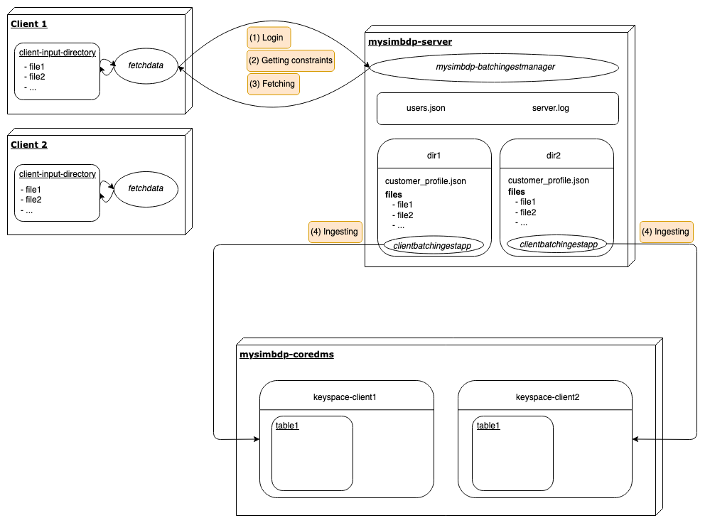

# Design report
This section details the architecture of the big data pipeline as well as the interactions between the components of the platform.


## Part 1 - Ingestion with batch
### General structure


### Components

#### Clients
Each client in this demo needs two main elements on their computer:
1. A directory called **client-input-directory**, that contains the files that the client want to ingest into the platform.
2. A script stored locally called **fetchdata**, responsible for communicating with the server of the big data platform with the aim of fetching the files of **client-input-directory** to the server.

In the framework of the project, two dummy users were created and were simulated locally on my computer. They can be found in the repository *code/clients*.

#### mysimbdp-server
A server, called **mysimbdp-server**, will make the bound between the clients and the database. This server stores the following elements:
1. A JSON file containing private data about each client of the platform. This file is of the form:
    ```json
    {
        "user1":{"username":"john_doe", "password":"1234", "client_dir":"dir1"},
        "user2":{"username":"jane_doe", "password":"1234", "client_dir":"dir2"}
    }
    ```

2. A .log file, called **server.log** containing information about successful/failed ingestion as well as metrics about ingestion time, data size, etc., for files which have been ingested into the platform. This file is of the form:
    ```log
    2019-10-31 18:16:27,572 :: INFO :: root : sample11.csv was correctly ingested into mysimbdp-coredms. File size: 98060 -- Total ingestion time: 4.960682599998108
    2019-10-31 18:16:31,116 :: INFO :: root : sample8.csv was correctly ingested into mysimbdp-coredms. File size: 116947 -- Total ingestion time: 3.5433159999993222
    2019-10-31 18:16:34,612 :: INFO :: root : sample9.csv was correctly ingested into mysimbdp-coredms. File size: 119116 -- Total ingestion time: 3.530958200000896
    ...
    ```

3. One repository per client that is called by the **client_dir** of the customer (see users.json). This repository will temporarily save the files of the corresponding client while they await to be ingest into the database (final sink). Each client repository on the server contains the following parts:
    - A JSON file, called **customer_profile.json**, that stores the file constraints related to the customer. Three constraints are defined, as can be seen in the example below:
        ```json
        {
            "max_file_size":200,
            "max_nb_files":5,
            "allowed_file_format":["csv", "xlm"]
        }
        ```

    - A directory **files** that contains the files respecting the user constraints that have been fetched from the client *client-input-directory*.
    - A script called **clientbatchingestapp** that will performed the ingestion of the files stored in **files** into the final database.

4. A script called **mysimbdp-batchingestmanager** that is responsible of all the interactions between the client and the server, and of calling the corresponding **clientbatchingestapp** of the users after fetching is done in order to ingest the files contained in the directory **files** into the corresponding user's keyspace in the database.

In the framework of the project, the server is implemented as a Docker container running a python image with Debian. In that container, a repository *"server/"* contains all the components described above. For the demo, this repository synchronizes locally in *code/mysimbdp-server/server*.


#### mysimbdp-coredms
Finally, the database, called **mysimbdp-coredms** will store the data in a structured way. It contains one keyspace per user, as users can have very different data to store in the platform. Here, the database is implemented as a Docker container running a Cassandra image. The keyspaces of the users are created by running the script *init_db.py* in *code/mysimbdp-coredms/* (see Deployment report for more details).

### Interaction between components
This section describe the interactions of the different components of the pipeline when a client wants to ingest some data to the final database (*mysimbdp-coredms*). 

Let's take the example of *client1*, that has 11 files in his *client-input-directory* on his computer and want to push them to the database of the big data platform. To do so, all the client has to do is to invoke his local *fetchdata* script by entering his username and password. By doing so, the script will:
1. **Login to the server.** Using the username and the password that the client gave him, the server will check in the *users.json* if they match. If it is the case, it will return to the client his *client_id*, that is the name of his repository on the server.
2. **Get user constraints.** Once his repository name known, *fetchdata* will ask the server the user constraints giving him this name.
3. **Fetch user data.** Thanks to the given constraints, *fetchdata* will then select the files that respect them and thus that can be ingest into the database.
4. **Ingest to database.** Once the correct user files on the server, *fetchdata* will notify it that everything has been pushed and he can now ingest the proper files into the final database. *mysimbdp-batchingestmanager* will then call the proper *clientbatchingestapp* stored on his server in the given user repository in order to perform the ingestion in the corresponding keyspace.


## Part 2 - Near-realtime ingestion
### General structure


### New components
- **ingestmessage** is a python script running locally on the user machine responsible for sending messages to **mysimbdp-messagebroker**.
- **mysimbdp-streamingestmanager** is a python script running continuously on **mysimbdp-server** that communicates with **mysimbdp-messagebroker** in order to see when messages have been received in the queue of a client and then calls the **clientstreamingestapp** in order to ingest these messages to the corresponding keyspace in **mysimbdp-coredms**.
- **mysimbdp-messagebroker** is the message broker component. In practice, it is a Docker container running an image of RabbitMQ.
- **clientstreamingestapp** is a python script stored on **mysimbdp-server** in the repository of each client that will be called by **mysimbdp-streamingestmanager** once messages have been received in the client's queue in **mysimbdp-messagebroker** in order to ingest data into the final database.