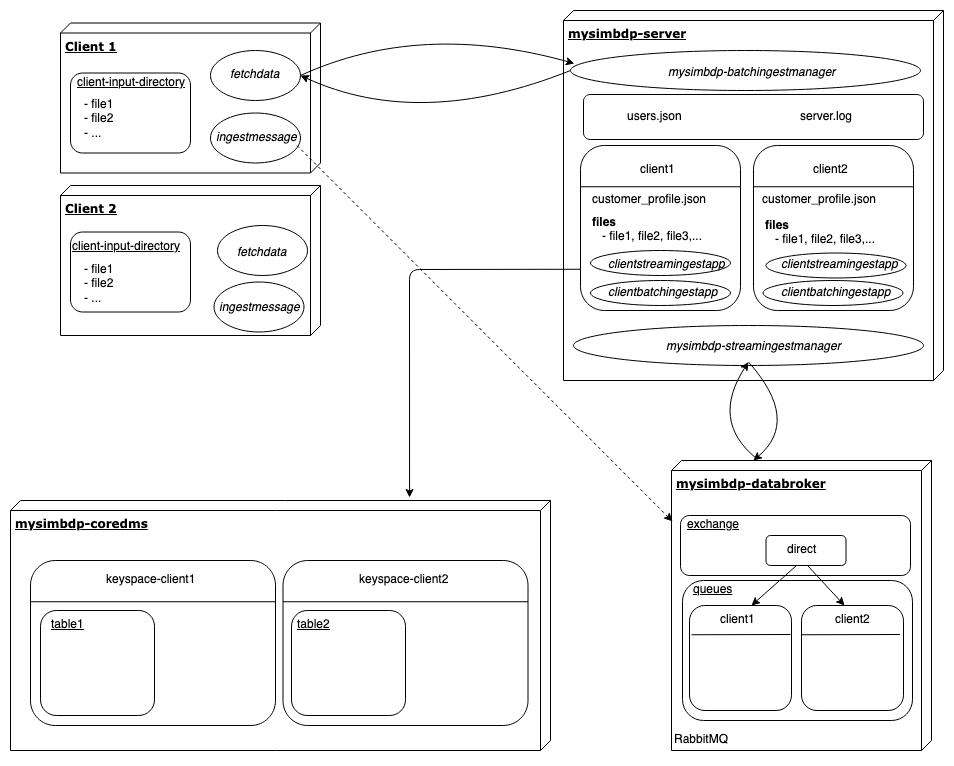

# Report

## Part 1 - Ingestion with batch
### 1. Defining ingestion constraints
Each user of the data platform will have a simple configuration file with the following parameters:
| Parameter           | Description     |
|--------------|---------------|
| max_nb_files | The maximum number of files that the client can ingest into the platform.|
| max_file_size | The maximum total size that the client can store in the database (in MB).|
| allowed_file_format | The type of file that the client can push to the platform. |

Hence, a user configuration file would look like the example below.
~~~json
{
    max_nb_files:5,
    max_file_size:10,
    allowed_file_format:["csv", "xml", "txt"]
}
~~~


### 2. Implementation of mysimbdp-fetchdata
*fetchdata* is a python script running locally on the machine of the client. See Design report for details about interactions with the other components and Deployment report for running commands.


### 3. Implementation of mysimbdp-batchingestmanager
*mysimbdp-batchingestmanager* is a python script running on the server that is responsible of communicating with the client. See Design report for details about interactions with the other components.

### 4. Developping test programs
The testing program can be found in *code/clients/performance.py*. See Deployment report for running command.

Basically, two fake users were created manually. Then, the python script analyzes the difference in ingestion speeds when only one user is ingesting data or the both of them. In order to make a fair comparison, both users have exactly the same constraints and the same files to ingest in their client-input-directory. Performances are showed below:


One can notice that ingestion to the database when two users are connected to the server is significantly slower than when only one user is ingesting data. It is actually almost two times slower, meaning that parallelism might not be functional in my Flask API as it seems to perform the clients requests sequentially. Future work would involve to improve the API in order to handle parallelism for handling multiple users requests in a faster way. 

Also, as I chose to limit the number of users to two for these tests, ingestion worked perfectly fine each time so no failures was experienced.

### 5. Providing logging features
The logging features are performed in the *mysimbdp-batchingestmanager* during the final ingestion into the database and stored into a file called *server.log*. This file contains information about successful/failed ingestion as well as ingestion time and data size for files which have been ingested into the platform. It also returns warning when ingestion failed. This file is of the form:
```log
2019-10-31 18:16:27,572 :: INFO :: root : sample11.csv was correctly ingested into mysimbdp-coredms. File size: 98060 -- Total ingestion time: 4.960682599998108
2019-10-31 18:16:31,116 :: INFO :: root : sample8.csv was correctly ingested into mysimbdp-coredms. File size: 116947 -- Total ingestion time: 3.5433159999993222
2019-10-31 18:16:34,612 :: INFO :: root : sample9.csv was correctly ingested into mysimbdp-coredms. File size: 119116 -- Total ingestion time: 3.530958200000896
...
```


## Part 2 - Near-realtime ingestion

### 1. Implementation of ingestmessagestructure
I chose to use AMQP with RabbitMQ for my message broker as it offers a variety of features to let me trade off performance with reliability, including persistence, delivery acknowledgements, publisher confirms, and high availability. The Design of the new architecture is illustrated in the Design report.

In my architecture, each client dispose of his own queue in the *mysimbdp-messagebroker*. Hence, the *ingestmessagestructure* will simply be the client data to ingest. As I used a .csv file for this demo, the messages will be one line of the csv.


### 2. Implementation of mysimbdp-streamingestmanager
**mysimbdp-streamingestmanager** is a python script running continuously on **mysimbdp-server** that communicates with **mysimbdp-messagebroker** in order to see when messages have been received in the queue of a client and then calls the **clientstreamingestapp** in order to ingest these messages to the corresponding keyspace in **mysimbdp-coredms**.


### 3. Developping test programs
To do.


### 4. Reporting
To do.


### 5. Providing features
To do.


## Part 3 - Integration and Extension

### 1. Integrated architecture
The integrated architecture would follow the following scheme:



The client would then have the choice to make both batch ingestion and near-realtime ingestion for his willing. More detailed explanations are given in the Design report.


### 2. Handling big files in batch ingestion.
Instead of simply denying the file if it is bigger than the imposed constraint, a solution could to divide this file into multiple ones of smaller sizes that respect the constraints, and then fetch these smaller files to the server with *fetchdata*. However, if we do so, we must ensure not to split the given file in the middle of a line for example, as it would cause problems for the ingestion in the database later. So either the client should take care of dividing the too big files properly in order not to cause problems for the ingestion, or the server could also concatenate back the divided files when they have all been fetched to the server.


### 3. Hiding client's code
The platform provider should not see the code of the customer for data privacy reasons. If you assume that each one of your customers have perfectly implemented their clientbatchingestapp and clientstreamingestapp according to the recommendations of mysimbdp and that these components are functional on the platform, the provider doesn't need to see what is hided behind, as long as it does the job. This aspect of data privacy is often highlighted for the big data platforms providers such as Google Cloud or AWS. In general, the customers do not want the platform to see the different operations it does to process his data.

However, not knowing the code that a customer push on your platform might be risky, as some dishonest user might push a software virus that could crash your entire server. 


### 4. Detecting quality of data
First, the platform should provide some pre-defined recommendations about the data that can be ingested into it. The customer should then take these recommendations into account and pre-process his data before pushing it to the platform. Second, the platform should not completely trust the customer and try to ingest his data directly into the final database but first perform some tests based on conditions to check if client has respected the recommendations.


### 5. Multiple clientbatchingestapp and clientstreamingestapp
For batch ingestion, *fetchdata* communicates with *mysimbdp-server* thanks to an API. When he wants to ingest some files that are available in his client-input-directory, he first connects to the server using his username and password, then gets the constraints on the files he can ingest and fetches the allowed files to the server. When the files to ingest are now on the server, *fetchdata* will use the API to notify *mysimbdp-batchingestmanager* that he can now perform the ingestion. This request takes in parameter the *client_id*, referring to the name of the client directory on the server where the fetched files and the *clientbatchingestapp* are stored. We could add an extra parameter to this request that will inform the server which *clientbatchingestapp* to use for the files that have been fetched.

For the near-realtime ingestion, one could simply add a field in each message with the name of the *clientstreamingestapp* to use for ingesting this particular message into the database.