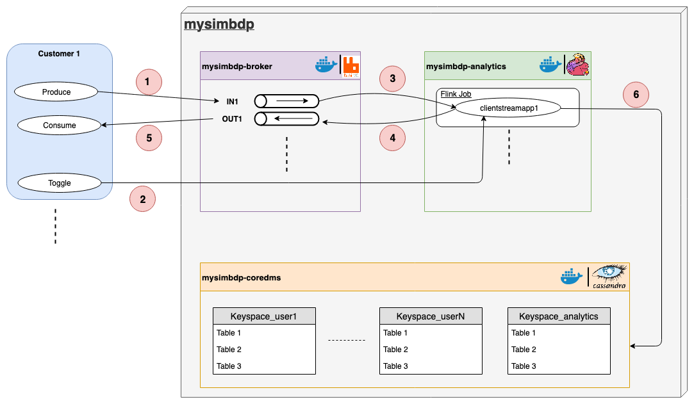

# Report

## Part 1 - Design for streaming analytics

### 1. Dataset selection and analytics for the customer

#### Dataset
For this project, I decided to use the BTS dataset provided by BachPhu, a company developing IoT solution in Vietnam. It is a collection of sensors data from base stations. The data structure is as follow:
* *station_id*: the id of the stations
* *datapoint_id*: the id of the sensor (data point)
* *alarm_id*: the id of the alarm
* *event_time*: the time at which the event occurs
* *value*: the value of the measurement of the datapoint
* *valueThreshold*: the threshold set for the alarm. Note that some threshold values are set to a default value of 999999.
* *isActive*: the alarm is active (true) or not (false)
* *storedtime*: no store

Note that the given dataset was split into different smaller datasets, each leveraging data about a given station (split according to the station_id). 

This dataset was chosen for multiple reasons. First of all, it is simple, clean and easy-to-use, and its size is reasonable (25.2 MB). Then, it is a good fit for streaming analytics. Indeed, in each dataset, each row represents a certain data event recorded at a given time (*event_time* represents the timestamp of the data event). Moreover, these data came from sensors that lend themselves well to analytics with near-realtime ingestion being really suitable to sensors.

#### Analytics
Now, let's give some example of analytics that could be performed with our dataset.

**(i) Streaming analytics which analyzes streaming data from the customer**
- Analyzing the frequency of alarms activations in a given station for each sensor. This could help detect which machine in the station might be defective when a high frequency is noticed.
- Checking if an alarm has been set. This simple but nevertheless practical analytics could for example notify the consumer with a warning.
- Analyzing the frequency of incoming data points for each sensor in a given station. This would be useful for detecting missing values due to a time out of the sensor.
- Keeping track of interesting values related to each sensor such as the (online) maximum/minimum/mean value of each sensor in a given station.
- Analyzing the consistency of the data points. This feature would obviously be useful to detect outliers in the incoming data and removing noise. Notice that it either requires a sufficiently large window or comparison could be made with the currently tracked mean value for example.
- ...

**(ii) Batch analytics which analyzes historical results outputted by the streaming analytics**
- Analyzing among all stations which types of alarm have been the most activated during a given period of time.
- Analyzing which stations have the bigger number of alarm activations for a given sensor.
- Analyzing in a given station which sensors activate the most the alarms.
- Analyzing for a given alarm in a given station at which moments of the day it is the most activated.
- ...

In brief, streaming analytics can be very useful for reliability analysis and anomaly detection, while batch analytics can further analyze the outputted statistics by plotting detailed histograms and graphs.

## 2. Discussion about streaming analytics

**(i) Should the analytics handle keyed or non-keyed data streams for the customer data?**

In the case of non-keyed streams, all elements in the stream are processed together and the user-defined function has access to all elements in a stream. At the opposite, in the case of a keyed stream, the stream can be partioned into multiple independent streams by a key. That way, when a window is processed in a keyed stream,the user-defined function only has access to items with the same key. In our case, where each station is equipped with multiple sensors linked to a certain number of alarms, keyed streams seem to be more suitable. Indeed, partitioning the stream according to the *datapoint_id* or *alarm_id* would allow us to gain in accuracy and flexibility in our analytics. We could then adapt the different analytics and window sizes (discussed in Question 3) in each stream in function of the characteristics of the given sensors or alarms, which makes more sense. Another advantage of working with keyed streams is that it allows to parallelize work, which is not possible for non-keyed streams where only one machine in the cluster will be able to execute our code.

**(ii) Which types of delivery guarantees should be suitable?**

Below are listed some guarantees that our platform could give to the customers:
* Handling missing data: three possibilities are discussed below in relation with our type of data.
    - At most once: message loss is possible and no duplication of messages. In failure scenarios, events will be dropped and re-delivery attempts are not made. At first glance, this delivery guarantee does not perfectly match our application for two reasons. First, we are dealing with sensors data that, if a threshold is exceeded, activates an alarm. In real life, the activation of the alarm could be critical and not receiving a message could definitely be a problem. Also, some sensors might not give data points at a high frequency, but maybe just once a day. In that case, one can not afford to lose even one data point for such a low emission frequency.

    - At least once: no message loss but duplication is possible. In event of failure scenarios, re-delivery attempts are made. This delivery guarantee might be a bit more suitable for our application. Indeed, as previously explained, losing messages might be problematic. Now, duplication either might or might not be a problem depending again on the frequency of the emitted data points. If the frequency is high, having duplicates will not false by a lot our analytics (mean for e.g.), but might completely false if one sensor only emits a few data points a day.

    - Exactly once: no message loss and no duplication of messages. For obvious reasons, this delivery guarantee is probably the most suitable for our application. It would ensures not to have the previously mentioned problems. 

- Handling out-of-order data: let's take an example to understand the importance of providing features to handle this problem. Imagine that each time an alarm is activated, customer receives a notification. At a certain time, an alarm is activated and a message is sent. A few seconds later, the situation is stabilised and another message is sent. If the first message arrives after the second one, it will notify the consumer that that alarm is now activated while it is now stabilised, which is problematic.

- Guaranteeing availability: providing fault tolerance features to ensure continuous processing of data by achieving near-realtime response with minimal overhead for high-volume data streams.

- Guaranteeing data safety: ensuring the customers to keep their data safe and private.

- Processing and responding instantaneously: achieving the near-realtime response with minimal overhead for high-volume data streams.

### 3. Types of time and types of windows to consider

**(i) Types of time to consider in stream processing**

The chosen dataset already provides timestamps which characterizes the moment when the measure was taken, i.e. the "application time" (also called the "event time"). We will use them in this project for our stream processing. 

Another alternative would be to re-generate timestamps when the messages arrive in the platform, therefore considering the so-called "arrival time". However, this alternative is far less robust than the previously mentioned one since we would take into account the "message received time" and not the "measure creation time". One can easily figuring out scenarios where this could be a problem for our analytics. For example, let's imagine for an instant that the network crashes for multiple minutes, while the sensors continue to measure values and store them temporarily in a buffer pending an answer for the network. When connection is restored, all the buffered messages are sent together and timestamps are created on the server side when they are received. Now, our streaming analytics might detect the activation of an alarm and send the consumer a warning, while this activation happened minutes ago. This example emphasizing the possible delays in the network shows properly the importance for the timestamps to be created on the device side. In addition, this requirement is also necessary for handling out-of-order data.

**(ii) Types of windows to develop for the analytics**

In this project, I chose to implement sliding windows of fixed sizes. Hence, a given window in a keyed stream will contain *n* data points from which the first half will already have been analyzed, processed and ingested into the database, and the second half not yet. This mechanism allows us to perform consistency check among "past" and "future" values which is very useful in an IoT context.

Now, two kinds of windows might be considered: timing windows and fixed size windows. A timing window will consider a given interval of time in which the elements where timestamps correspond will be processed. At the opposite, fixed size window will take into account a given number of data points, whatever their timestamps, and process these points. Both types of windows might be suitable for our application. However, it also depends on the intrinsic characteristics of the sensors, particularly of their frequency of emission. This strengthens even more my choice to consider keyed streams, as independent windows can be set individually for each sensor. Indeed, if a sensor only emits a few data points every hour, then it wouldn't make any sense to consider a timing window of a few seconds. In that case, a larger interval of time must be considered, or a fixed size window should be chosen.

It is difficult to draw out these types of windows as they both might be suitable for our dataset. For the ease of this project, I chose to use fixed size windows of a given number of elements *n*.

Notice that in practice, the consumer should also have the choice to impose which kind of windows better match his application, as he is the one to exactly know the data he is sending to the platform.

### 4. Important performance metrics for the streaming analytics

First, we can consider metrics related to time:
* Response time: Indicates the required time for the platform to send a response to the source for a given event (in milliseconds).
* Out-of-order events: Indicates the number of events received out of order, that were either dropped or given an adjusted timestamp. 
* Late input events: Indicates the number of events arriving late from the source (according to a configured arrival tolerance window). This metric can include events that have been dropped or have had their timestamp adjusted.
* Early input events: Indicates the number of events whose timestamp is earlier than their arrival time by more than a given threshold (5 minutes for e.g.).
* Watermark delay: Indicates the delay of the streaming data processing job. It is computed as the wall clock time of the processing node minus the largest watermark it has seen so far.

Then, other useful metrics are:
* Throughput: Indicates the amount of data received by the stream analytics job (in bytes). 
* Input events received: Indicates the number of events received by the platform.
* Deserialization errors: Indicates the number of input events that could not be deserialized.
* Runtime errors: Indicates the total number of errors related to query processing.

Notice that these kinds of metrics are often available in well-known Big Data Platforms such as [Microsoft Azure](https://docs.microsoft.com/en-us/azure/stream-analytics/stream-analytics-time-handling).

### 5. Architecture design

The design of my architecture for the streaming analytics service is shown in the Figure below:

#### Pipeline
Here are the different steps of the pipeline:

1. Customer produces data, i.e. sends data points through a continuous flow to his dedicated channel *in1* in the RabbitMQ Message Broker.
2. Then, the customer can decide whenever he wants to start/stop the analytics on his data. Toggling the *start_analytics* script will copy the *customerstreamapp* (implemented by the customer) on the Flink server and begin the stream processing on the Flink server.
3. The Flink job running the *customerstreamapp* of the customer will read data from the input channel of the customer and perform near-realtime analytics on them.
4. Each analytics performed by the *customerstreamapp* running on the Flink server will be sent to the output channel of the customer in the RabbitMQ Message Broker.
5. From there, the consumer is able to consumer the messages arriving in his output channel to explore the computed analytics.
6. Optionally, the analytics performed by the *customerstreamapp* can be stored into the Cassandra database.

#### Customer data sources
In real life, the customer data sources will be sensors that will output data points with a timestamp created when measure is taken. In practice for this project, we will use data points already collected and stored in a *.csv* file. Hence, we will simulate the emission of data points from the sensors by reading the *.csv* file row by row at given interval of time. The original dataset *bts-data-alarm-2017.csv* has been sorted by timestamp in chronological order to reproduce a real-life emission of data points. It has then been splitted into multiple subdatasets to play with lighter files.

#### Mysimbdp message brokers
RabbitMQ was chosen as the message broker for this project but has not been my first choice. I first tried to implement a streaming pipeline with Apache Kafka + Apache Spark mainly because of the popularity of these tools in the industry. However, I encountered some severe difficulties in the management and connection between the Docker containers of this pipeline, and after multiple days of debugging without solutions, I finally decided to give a chance at RabbitMQ with Flink as streaming analytics service. 

It turned out that RabbitMQ might have some advantages over Kafka: 
* It offers a variety of features to trade off performance with reliability, including persistence, delivery acknowledgements publisher confirms, and high availability.
* It is true streaming, contrary to Kafka which actually performs micro-batching.
* Deployment is easier and lighter than with Kafka, which requires Zookeeper to work properly, so involves to run an extra container.
* It has highly available queues that can be mirrored across several machines in a cluster, ensuring that even in the event of hardware failure your messages are safe.
* It supports messaging over a variety of messaging protocols.
* It offers great clustering, where several RabbitMQ servers on a local network can be clustered together, forming a single logical broker. 

In my configuration, each customer has exactly two channels in the RabbitMQ Message Broker: one input channel for him to send his data points, and one output channel to receive the results of the analytics. RabbitMQ Message Broker is running in a Docker container.

#### Mysimbdp streaming computing service
As RabbitMQ has been chosen as message broker, I decided to use Flink as the streaming service, as it often is a common choice. Moreover, documentation is highly available on the net and the tutorial of Mr. Truong was really helpful. 

Flink is an excellent choice for multiple reasons. First, it supports both stream and batch processing. In addition, it has a sophisticated state management, event-time processing semantics, and exactly-once consistency guarantees for state. Moreover, Flink can be deployed on various resource providers (YARN, Apache Mesos, Kubernetes) but also as stand-alone cluster. It has been configured for high availability and does not have a single point of failure. Finally, it is highly scalable, delivering high throughput and low latency.

#### Customer streaming analytics app
In this project, the customer is expected to implement its own *customerstreamapp* written in the Java programming language and compiled with Maven in order to get a *.jar* file that will run on the Flink server.

#### Mysimbdp-coredms
The mysimbdp-coredms component has been designed as a Cassandra database. Apache Cassandra is a free and open-source, distributed, wide column store, NoSQL database management system designed to handle large amounts of data across many commodity servers, providing high availability and scalability with no single point of failure.  In practice, the Cassandra database of this demo is running as a single node in a Docker container.

## Part 2 - Implementation of streaming analytics

### 1. Implemented structures of the input streaming data, output result and data serialization/deserialization for customerstreamapp

### 2. Key logic of functions for processing events/records in customerstreamapp

### 3. Discussion about the test environments, the analytics and its performance observations

### 4. Presentation of the tests and management of wrong data

### 5. Parallelism settings: performance and issues

## Part 3 - Connection

### 1. 